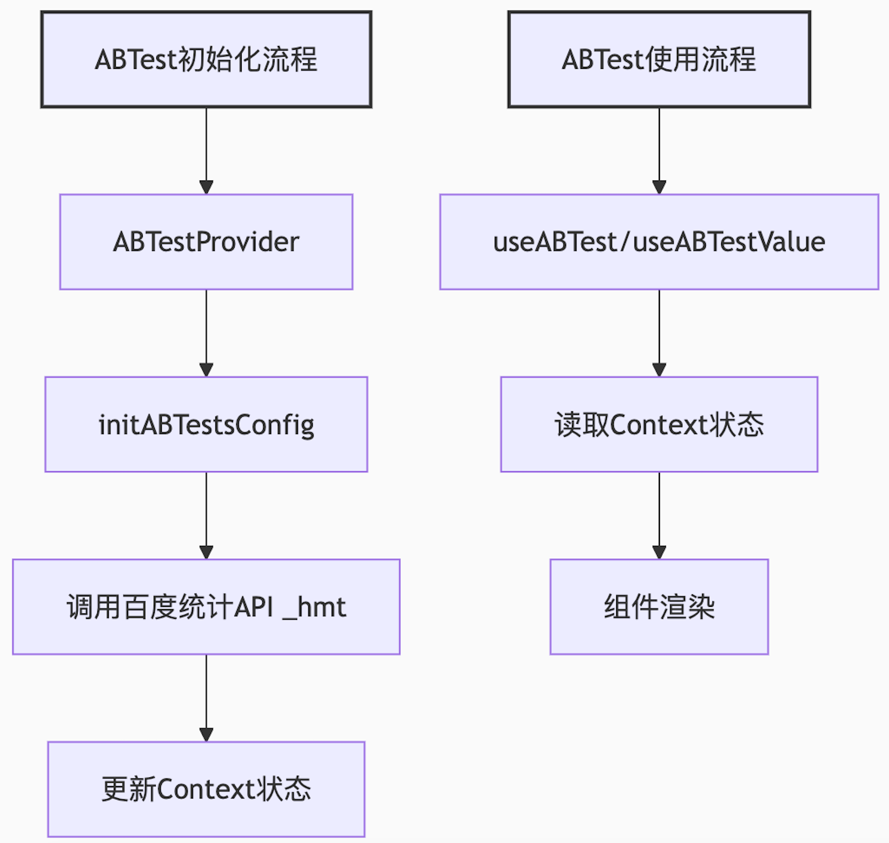

<h1 align='center'>
<samp>ABTest Kit 🔧 </samp>
</h1>


<p align='center'>
  <samp>🔧 Lightweight A/B testing SDK with multiple traffic splitting strategies and optional React integration, built with robuild, only 2.2 kb</samp>
<br>
<br>

[](https://github.com/sunny-117/abtest-kit/actions/workflows/unit-test.yml)
[![npm version][npm-version-src]][npm-version-href]
[![npm downloads][npm-downloads-src]][npm-downloads-href]
[![bundle][bundle-src]][bundle-href]
[![JSDocs][jsdocs-src]][jsdocs-href]
[![License][license-src]][license-href]

[简体中文](./README.zh-CN.md) | English

## Introduction

**Core Features:**

- **Zero Dependencies Core**: Pure JavaScript implementation, works standalone
- **Optional React Integration**: Provides Hooks and Context API
- **Multiple Splitting Strategies**: Random, CRC32, custom functions
- **Persistent Storage**: localStorage-based result caching with custom storage support
- **Flexible Configuration**: Supports Baidu Analytics or fully custom
- **Incremental Updates**: Smart config change detection and re-splitting
- **Debug Friendly**: URL parameter force hit, controllable logging
- **High Test Coverage**: 100% core logic coverage, 94%+ overall coverage

## Installation

```bash
npm install abtest-kit
# or
pnpm add abtest-kit
# or
yarn add abtest-kit
```

**Optional Dependencies:**

- React 18+ (only required when using React integration)

## Import Methods

The SDK provides two separate entry points to optimize bundle size:

```javascript
// Method 1: Core API only (no React dependency, smaller bundle)
import { initGlobalABTest, getGlobalABTestValue } from 'abtest-kit';

// Method 2: React integration (includes React components and hooks)
import { ABTestProvider, useABTest, useABTestValue } from 'abtest-kit/react';
```

| Entry Point | Bundle Size | React Required | Use Case |
|-------------|-------------|----------------|----------|
| `abtest-kit` | ~1.8 KB | No | Vanilla JS, Vue, Angular, etc. |
| `abtest-kit/react` | ~2.4 KB | Yes | React applications |

## Quick Start

### Method 1: Standalone Usage (No React Required)

Suitable for any JavaScript project, perform traffic splitting on page load:

```javascript
import { initGlobalABTest, getGlobalABTestValue } from 'abtest-kit';

// Define splitting configuration
const config = {
  newFeature: {
    key: 'new_feature',
    groups: {
      0: 50,  // Control group 50%
      1: 50   // Experiment group 50%
    }
  }
};

// Initialize splitting (results are automatically cached to localStorage)
const result = initGlobalABTest(config);

// Get splitting value anywhere
const featureValue = getGlobalABTestValue('newFeature');

if (featureValue === 1) {
  // Show new feature
} else {
  // Show old feature
}
```

### Method 2: React Integration

Suitable for React applications, provides reactive splitting state:

```tsx
import { ABTestProvider, useABTestValue } from 'abtest-kit/react';

const abTestConfig = {
  featureA: {
    key: 'feature_a',
    value: -1,
    groups: { 0: 50, 1: 50 },
    strategy: 'random'
  }
};

function App() {
  return (
    <ABTestProvider abTestConfig={abTestConfig}>
      <YourComponent />
    </ABTestProvider>
  );
}

function YourComponent() {
  const featureValue = useABTestValue('featureA');

  return (
    <div>
      {featureValue === 1 ? 'New Feature' : 'Old Feature'}
    </div>
  );
}
```

## Core API

### Standalone API

#### `initGlobalABTest(config, options?)`

Initialize global traffic splitting, results are cached to localStorage.

```typescript
const result = initGlobalABTest(
  {
    test1: {
      key: 'test1',
      groups: { 0: 50, 1: 50 }
    }
  },
  {
    strategy: 'random',  // 'random' | 'crc32' | custom function
    userId: 'user123',   // required for crc32 strategy
    storageKey: '__abtest__'  // custom storage key
  }
);
```

#### `getGlobalABTestValue(testName, storageKey?)`

Get the splitting value for a specific test.

```typescript
const value = getGlobalABTestValue('test1');  // Returns 0 or 1 or -1 (not initialized)
```

#### `getGlobalABTestUserstat(storageKey?)`

Get the statistics string for all splitting results.

```typescript
const userstat = getGlobalABTestUserstat();  // "test_1-0;test_2-1"
```

#### `resetGlobalABTest(config, options?)`

Clear cache and re-split.

```typescript
const newResult = resetGlobalABTest(config);
```

### React API

> **Note:** React API should be imported from `abtest-kit/react`

#### `<ABTestProvider>`

React context provider.

```tsx
import { ABTestProvider } from 'abtest-kit/react';

<ABTestProvider
  abTestConfig={config}
  options={{ userId: 'user123' }}
  injectScript={() => {
    // Optional: inject Baidu Analytics script
  }}
>
  <App />
</ABTestProvider>
```

#### `useABTest()`

Get the complete AB test context.

```tsx
import { useABTest } from 'abtest-kit/react';

const { abTestConfig, pending, userstat } = useABTest();
```

#### `useABTestValue(testName)`

Get the value for a specific test.

```tsx
import { useABTestValue } from 'abtest-kit/react';

const value = useABTestValue('test1');
```


## Traffic Splitting Strategies

### Random Strategy (Default)

Completely random splitting, randomly assigned on each initialization.

```javascript
initGlobalABTest(config, { strategy: 'random' });
```

### CRC32 Strategy

Deterministic splitting based on user ID, same user always assigned to same group.

```javascript
initGlobalABTest(config, {
  strategy: 'crc32',
  userId: 'user_12345'
});
```

**Why CRC32?**

In **first-screen performance optimization** scenarios, we cannot wait for splitting results before determining the user path. CRC32 provides a **fast and stable** splitting solution:

- **Problem with traditional approach**: `Math.random()` changes on every refresh, making it impossible to determine stable experiment group assignment, causing data alignment issues in performance analysis.
- **CRC32 benefits**:
  - Stable and reproducible experiment grouping
  - No waiting for splitting results during first-screen loading
  - Consistent numerator/denominator metrics for analytics
  - Can be reproduced in SQL: `crc32(userId) % 100`

### Custom Strategy

Pass a custom function to implement specific splitting logic.

```javascript
// Global custom strategy
initGlobalABTest(config, {
  strategy: (groups) => {
    // Time-based splitting
    const hour = new Date().getHours();
    return hour % 2 === 0 ? 0 : 1;
  }
});

// Per-experiment custom strategy
const config = {
  test1: {
    key: 'test1',
    groups: { 0: 50, 1: 50 },
    strategy: (groups) => {
      // Only applies to this experiment
      return Math.random() > 0.7 ? 1 : 0;
    }
  }
};
```

### Baidu Analytics Strategy

Integration with Baidu Analytics A/B testing platform (requires React).

```tsx
import { ABTestProvider } from 'abtest-kit/react';

<ABTestProvider
  abTestConfig={{
    test1: {
      key: 'test1',
      value: -1,
      strategy: 'baiduTongji'
    }
  }}
  injectScript={() => {
    const script = document.createElement('script');
    script.src = '//hm.baidu.com/hm.js?YOUR_SITE_ID';
    document.head.appendChild(script);
  }}
>
  <App />
</ABTestProvider>
```

## Data Flow



## Architecture

### Design Principles

1. **Minimal Dependencies**: Core functionality has no framework dependencies
2. **Progressive Enhancement**: React integration as optional extension
3. **Flexible & Extensible**: Support custom strategies and cache implementations
4. **Performance First**: Initialization <5ms, memory <1KB
5. **Developer Experience**: Complete TypeScript type support

### Architecture Layers

```
+-------------------------------------------------------------+
|                      Application Layer                       |
|  +---------------------+  +-----------------------------+   |
|  |   React Apps        |  |   Non-React Apps            |   |
|  |   (Vue/Angular/JS)  |  |   (Early page load/Pure JS) |   |
|  +----------+----------+  +--------------+--------------+   |
+-------------|-----------------------------|------------------+
              |                             |
+-------------v-----------------------------v------------------+
|                      SDK Entry Points                        |
|  +---------------------+  +-----------------------------+   |
|  |  abtest-kit/react   |  |       abtest-kit            |   |
|  |  (~2.4 KB)          |  |       (~1.8 KB)             |   |
|  |  - ABTestProvider   |  |  - initGlobalABTest         |   |
|  |  - useABTest        |  |  - getGlobalABTestValue     |   |
|  |  - useABTestValue   |  |  - setGlobalCache           |   |
|  +----------+----------+  +--------------+--------------+   |
+-------------|-----------------------------|------------------+
              |                             |
              +-------------+---------------+
                            |
+---------------------------v---------------------------------+
|                      Core Layer                              |
|  +--------------+ +--------------+ +----------------------+ |
|  | Strategies   | | Storage      | | Utilities            | |
|  | - Random     | | - CacheStorage| | - Logger            | |
|  | - CRC32      | | - localStorage| | - forceHitTestFlag  | |
|  | - Custom     | | - Custom impl | | - getConfigHash     | |
|  | - BaiduTongji| +--------------+ +----------------------+ |
|  +--------------+                                           |
+-------------------------------------------------------------+
```

### Incremental Update Algorithm

```
Input: new configMap
      |
Read from cache: storedResult, storedConfigHashes
      |
For each key in configMap:
      |
      +-- key exists in cache AND configHash unchanged?
      |       -> Keep original value
      |
      +-- key exists in cache BUT configHash changed?
      |       -> Re-split
      |
      +-- key not in cache?
              -> New split
      |
Save new results (only keys in current configMap)
      |
Return splitting results
```

### Storage Structure

```json
{
  "result": {
    "experimentA": 0,
    "experimentB": 1
  },
  "configHashes": {
    "experimentA": "0:50|1:50",
    "experimentB": "0:30|1:70"
  }
}
```

## Advanced Features

### Custom Cache Storage

By default, splitting results are stored in `localStorage`. You can customize the cache implementation using `setGlobalCache`.

#### Cache Interface

```typescript
interface CacheStorage {
  getItem(key: string): string | null;
  setItem(key: string, value: string): void;
  removeItem(key: string): void;
}
```

#### Using sessionStorage

```javascript
import { setGlobalCache, initGlobalABTest } from 'abtest-kit';

setGlobalCache({
  getItem: (key) => sessionStorage.getItem(key),
  setItem: (key, value) => sessionStorage.setItem(key, value),
  removeItem: (key) => sessionStorage.removeItem(key)
});

initGlobalABTest(config);
```

#### Using Cookie

```javascript
import { setGlobalCache } from 'abtest-kit';

setGlobalCache({
  getItem: (key) => getCookie(key),
  setItem: (key, value) => setCookie(key, value, { expires: 365 }),
  removeItem: (key) => deleteCookie(key)
});
```

#### Using IndexedDB

```javascript
import { setGlobalCache } from 'abtest-kit';

const cache = new Map();

async function initCache() {
  const data = await loadFromIndexedDB();
  data.forEach((value, key) => cache.set(key, value));
}

setGlobalCache({
  getItem: (key) => cache.get(key) ?? null,
  setItem: (key, value) => {
    cache.set(key, value);
    saveToIndexedDB(key, value);
  },
  removeItem: (key) => {
    cache.delete(key);
    removeFromIndexedDB(key);
  }
});
```

#### Reset to Default Cache

```javascript
import { resetGlobalCache } from 'abtest-kit';

resetGlobalCache();
```

### Debug Tools

**Force Hit Mode:**

```
https://example.com?forceHitTestFlag=experiment_a-1;experiment_b-0
```

- Force specify splitting results via URL parameters
- Convenient for development and testing

**Log Control:**

```typescript
import { logger, LogLevel } from 'abtest-kit';

logger.setLevel(LogLevel.DEBUG);  // Enable detailed logs
logger.setLevel(LogLevel.ERROR);  // Show errors only
```

## Important Notes

1. React API's default splitting strategy is based on Baidu Analytics, ensure Baidu Analytics experiment splitting is properly configured before using the SDK
2. Initialization is asynchronous, consider the `pending` state when using `useABTestValue`
3. Global splitting uses localStorage by default, ensure browser supports localStorage, or use `setGlobalCache` to customize storage
4. Global splitting results are permanently retained once saved, unless actively calling `resetGlobalABTest()` or `clearGlobalABTestCache()`
5. Configuration changes (including traffic ratio adjustments) will trigger re-splitting, modify configuration with caution
6. Custom cache must be set before calling `initGlobalABTest`

## Best Practices

1. Centralize A/B test configuration management
2. Use TypeScript to define configuration types
3. Properly use forced test mode for development debugging
4. Call global splitting early in page load to ensure consistency
5. Use different storageKeys for different tests to avoid conflicts

## Performance

| Metric | Value |
|--------|-------|
| Initialization time | <5ms |
| Memory usage | <1KB |
| Core bundle size | ~1.8KB (gzip) |
| React bundle size | ~2.4KB (gzip) |

## Compatibility

- Browsers: Modern browsers supporting ES6+
- React: 18.0+
- Node.js: Requires localStorage polyfill for SSR

## License

[MIT](./LICENSE) License © [Sunny-117](https://github.com/Sunny-117)

<!-- Badges -->

[npm-version-src]: https://img.shields.io/npm/v/abtest-kit?style=flat&colorA=080f12&colorB=1fa669
[npm-version-href]: https://npmjs.com/package/abtest-kit
[npm-downloads-src]: https://img.shields.io/npm/dm/abtest-kit?style=flat&colorA=080f12&colorB=1fa669
[npm-downloads-href]: https://npmjs.com/package/abtest-kit
[bundle-src]: https://img.shields.io/bundlephobia/minzip/abtest-kit?style=flat&colorA=080f12&colorB=1fa669&label=minzip
[bundle-href]: https://bundlephobia.com/result?p=abtest-kit
[license-src]: https://img.shields.io/github/license/Sunny-117/abtest-kit.svg?style=flat&colorA=080f12&colorB=1fa669
[license-href]: https://github.com/Sunny-117/abtest-kit/blob/main/LICENSE
[jsdocs-src]: https://img.shields.io/badge/jsdocs-reference-080f12?style=flat&colorA=080f12&colorB=1fa669
[jsdocs-href]: https://www.jsdocs.io/package/abtest-kit
